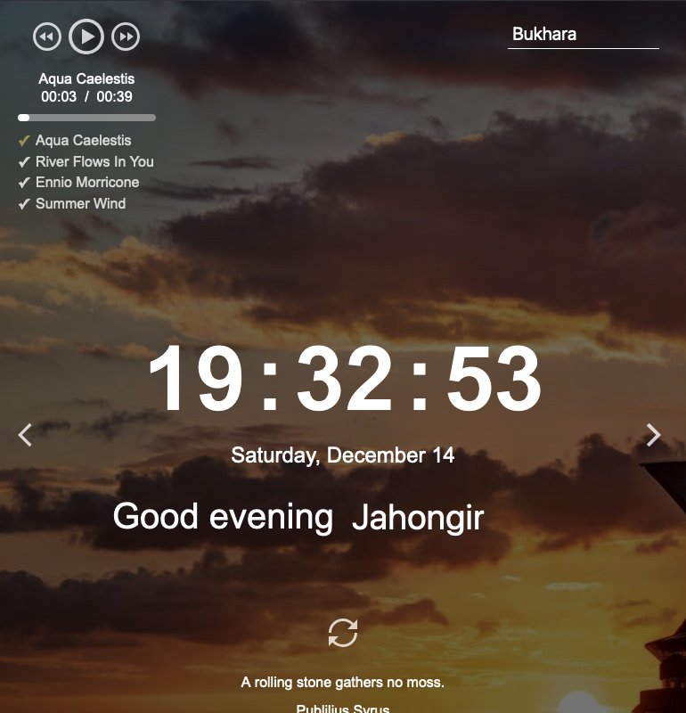
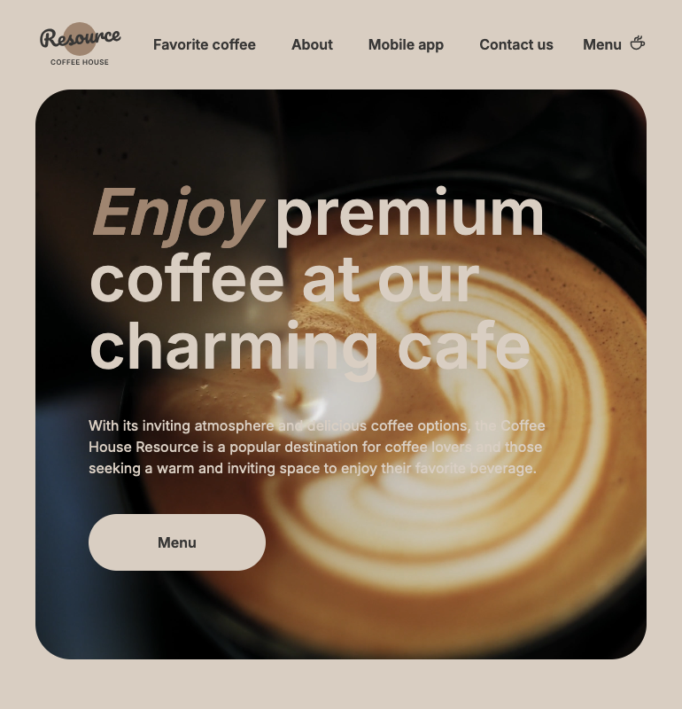
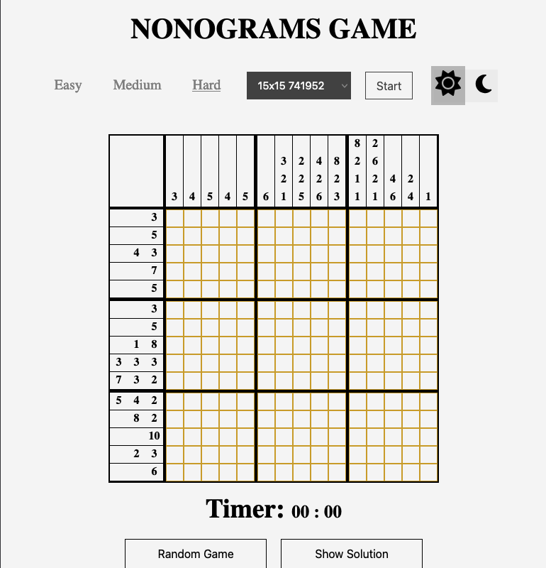
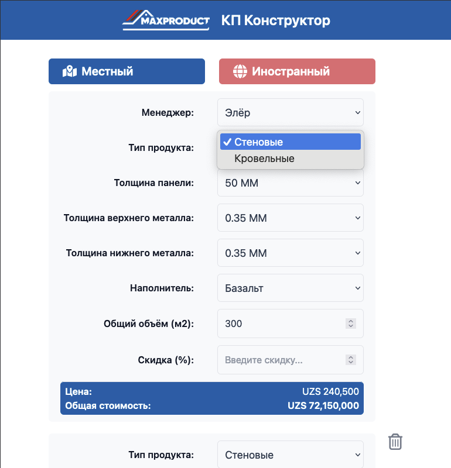
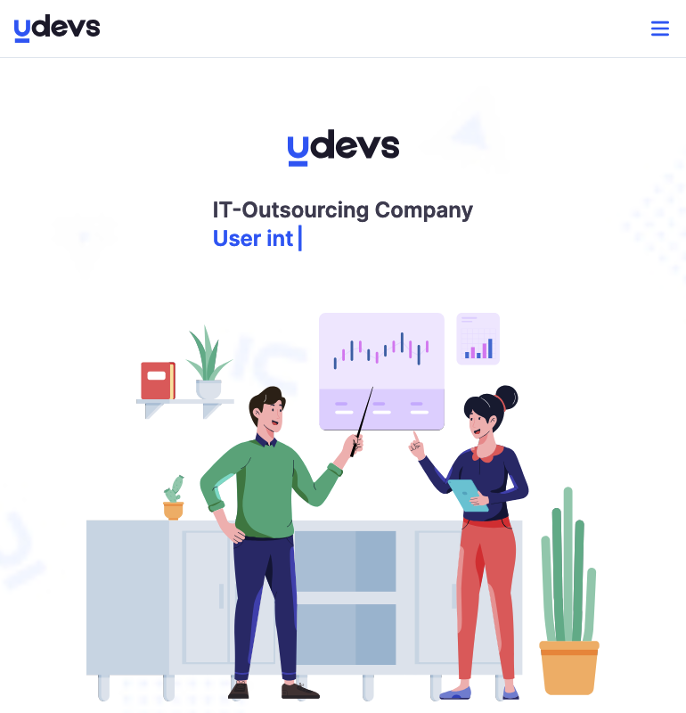
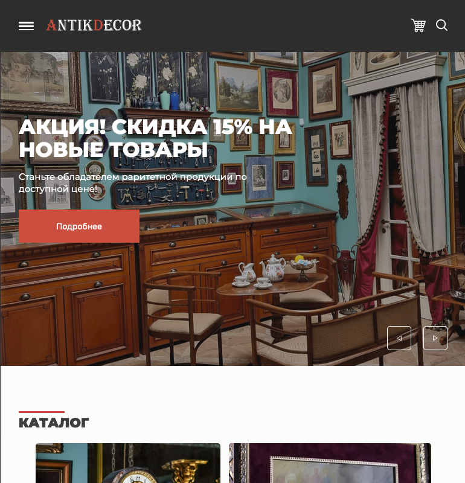

<h1 align="center">Hi 👋, I'm Jahongir</h1>
<h3 align="center">A passionate fullstack web developer</h3>

 
 
 

<h2 align="left">Contacts</h2>

☎️ [+998933138899](tel:+998933138899)

 
 
 

<h2>Projects</h2>

  
  
 

  
  
 

<h2 align="left">About me</h2>

I am a skilled fullstack web developer and freelancer from Bukhara. With over 2 years of experience, specialized in React and Next.js, including server-side rendering, and have expertise in TypeScript, Tailwind CSS. Known for creating responsive and dynamic web applications, I am passionate about delivering high-quality solutions tailored to client needs. Outside of coding, I am a book lover and bring a focused and determined approach to both work and life.

<h2>Education</h2>

- 🎓 Bachelor degree in Automation Engineering - [Bukhara Engineering Technological Institute](https://bmti.uz/)
- 📜 The Frontend Developer Career Path: [certificate](https://v1.scrimba.com/certificate/u7EQyehW/gfrontend)
- 📜 The Complete 2024 Web Development Bootcamp: [certificate](https://www.udemy.com/certificate/UC-a157eb48-abfc-46af-9864-d99eaa19de0f/)

