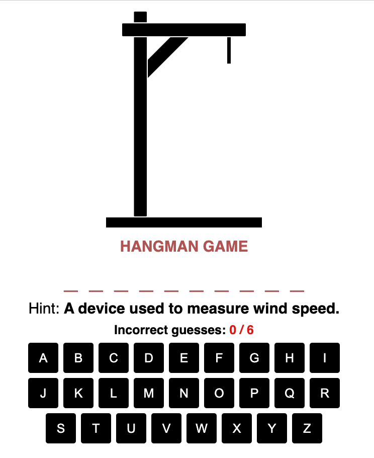
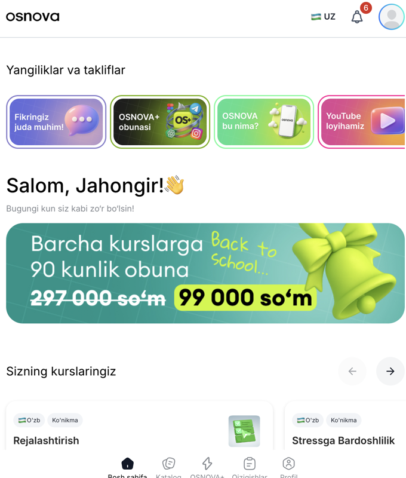
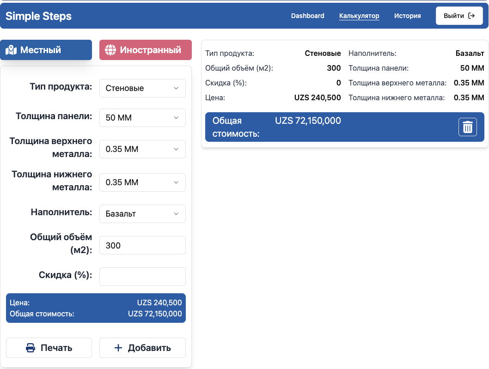

<h1 align="center">Hi 👋, I'm Jahongir</h1>
<h3 align="center">A passionate fullstack web developer</h3>

 
 
 
 

<h2 align="left">Contacts</h2>

☎️ [+998933138899](tel:+998933138899)

 
 
 

<h2 align="left">Currently</h2>
<h4>Working on:</h4>

- [UTAS](https://utas.uz/) - university website. Tech Stack: Next.js (pages router) | Chakra UI | SCSS | Redux | Tanstack Query
- [Osnova](https://my.osnovaedu.uz/) - online course selling market. Tech Stack: React | Chakra UI | SCSS | ReduxToolkit | Tanstack Query

 <h4>Studying at:</h4>
 
 - [React Course · RS School 2025 Q3] - [link](https://wearecommunity.io/events/rs-react-2025q3)

<h2>Projects</h2>

  
  
  

  
  
 
 
 
 

  
  
  

 
  

  
  
  
  

  

  
  
  

  
 

  
  
  
  
  

  

<h2 align="left">About me</h2>

I am a enthusiastic fullstack web developer and freelancer. With over 2 years of experience, specialized in React and Next.js, including server-side rendering, and have expertise in TypeScript, Tailwind CSS. Known for creating responsive and dynamic web applications, I am passionate about delivering high-quality solutions tailored to client needs. Outside of coding, I am a book lover and bring a focused and determined approach to both work and life.

<h2>Education</h2>

- 🎓 Bachelor degree in Automation Engineering - [Bukhara Engineering Technological Institute](https://bmti.uz/)
- 📜 The Frontend Developer Career Path: [certificate](https://v1.scrimba.com/certificate/u7EQyehW/gfrontend)
- 📜 The Complete 2024 Web Development Bootcamp: [certificate](https://www.udemy.com/certificate/UC-a157eb48-abfc-46af-9864-d99eaa19de0f/)
- 📜 JavaScript / Front-end Course (rs.school): [certificate](https://app.rs.school/certificate/q1x43opf)
- 📜 the Beginner level JavaScript training (epam): [certificate](https://drive.google.com/file/d/1P3HtiMXp7fbvmcZaktTTTNL32uoVfVQF/view)

<h2>Sertifications</h2>

- [Introduction to Career Skills in Software Development](https://www.linkedin.com/learning/certificates/9e337fd0bbaca3a3e046f1dfe0c936eaa805a21d8d312abd3dd8d37292517506?lipi=urn%3Ali%3Apage%3Ad_flagship3_profile_view_base%3Bz%2FfFtR%2BLQ4yORXh5rth6EQ%3D%3D)
- [Programming Foundations: Fundamentals](https://www.linkedin.com/learning/certificates/ef745e4617bd6ac8e38b7818735bbfeb2962e7f5a07c22138fcf25d00117d71c?lipi=urn%3Ali%3Apage%3Ad_flagship3_profile_view_base_certifications_details%3Bq8B%2FnrSYR0y6HcEvx24OvQ%3D%3D)
- [CSS (Basic)](https://www.hackerrank.com/certificates/1e5c5e7ee13a)
- [JavaScript (Basic)](https://www.hackerrank.com/certificates/6e0c0cdfef63)
- [JavaScript (Intermediate)](https://www.hackerrank.com/certificates/b3c5f28eec64)
- [React (Basic)](https://www.hackerrank.com/certificates/d6f81bc6d0dc)
- [Problem Solving (Basic)](https://www.hackerrank.com/certificates/a21699ffe8bb)

<h2>Honors</h2>

Codewars: 

LeetCode: [visit](https://leetcode.com/u/mrJakhongir/)

HackerRank: [visit](https://www.hackerrank.com/profile/mrjakhongir)

Here is a collection of badges I earned from completing Microsoft Learn's TypeScript modules:

1. **Getting Started with TypeScript**: [Badge](https://learn.microsoft.com/api/achievements/share/en-gb/mrjakhongir/BTG5M5GD?sharingId=1E29DCDAA54BBED2)
2. **Declare Variable Types in TypeScript**: [Badge](https://learn.microsoft.com/api/achievements/share/en-gb/mrjakhongir/ZM4EEJE2?sharingId=1E29DCDAA54BBED2)
3. **Implement Interfaces in TypeScript**: [Badge](https://learn.microsoft.com/api/achievements/share/en-gb/mrjakhongir/HNRXGXA8?sharingId=1E29DCDAA54BBED2)
4. **Develop Typed Functions in TypeScript**: [Badge](https://learn.microsoft.com/api/achievements/share/en-gb/mrjakhongir/3WTJSGKH?sharingId=1E29DCDAA54BBED2)
5. **Declare and Instantiate Classes in TypeScript**: [Badge](https://learn.microsoft.com/api/achievements/share/en-gb/mrjakhongir/KJLT8WTB?sharingId=1E29DCDAA54BBED2)
6. **Generics in TypeScript**: [Badge](https://learn.microsoft.com/api/achievements/share/en-gb/mrjakhongir/8FAYYVRW?sharingId=1E29DCDAA54BBED2)
7. **Work with External Libraries in TypeScript**: [Badge](https://learn.microsoft.com/api/achievements/share/en-gb/mrjakhongir/UF5WVMX3?sharingId=1E29DCDAA54BBED2)
8. **Organize Code with Namespaces in TypeScript**: [Badge](https://learn.microsoft.com/api/achievements/share/en-gb/mrjakhongir/UF5WJAS3?sharingId=1E29DCDAA54BBED2)

